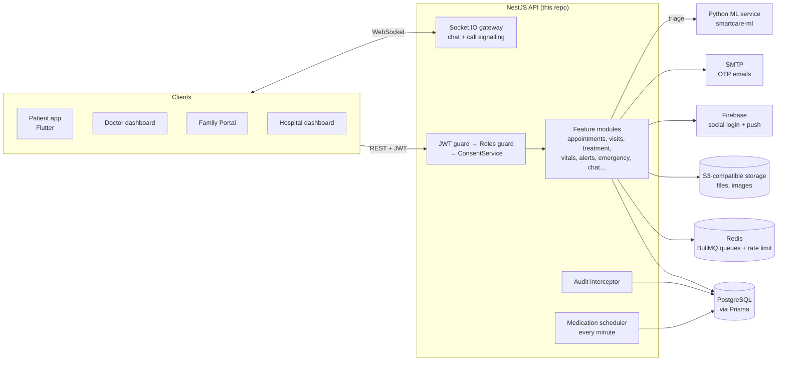
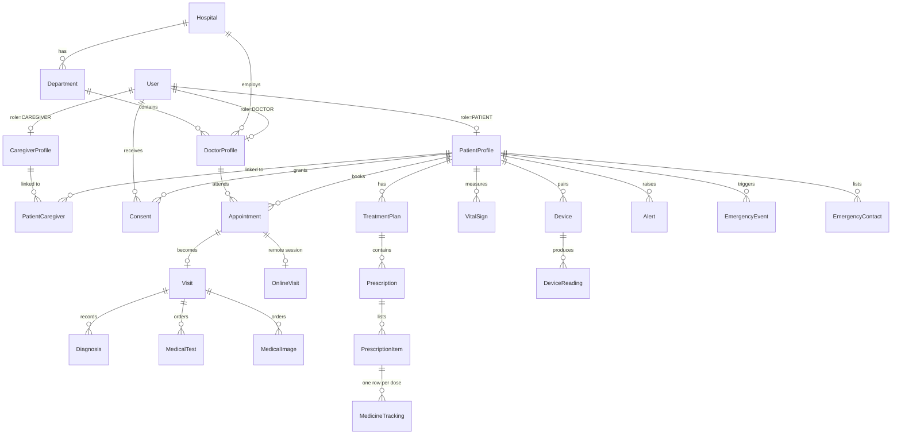
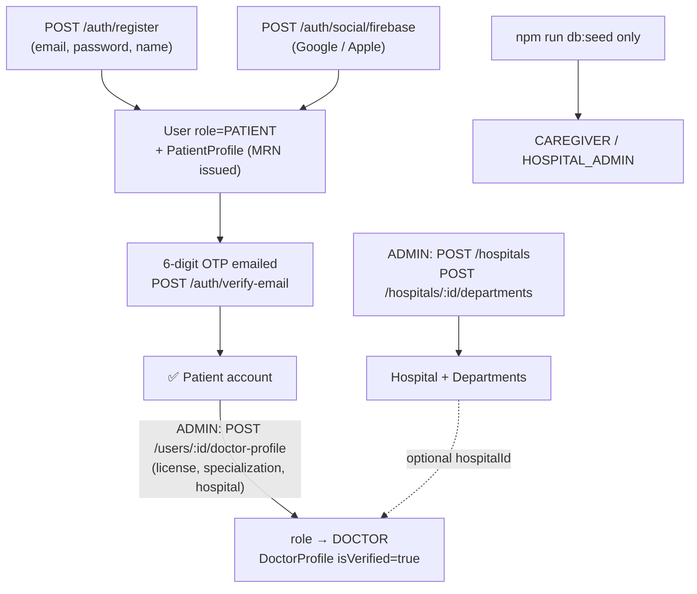
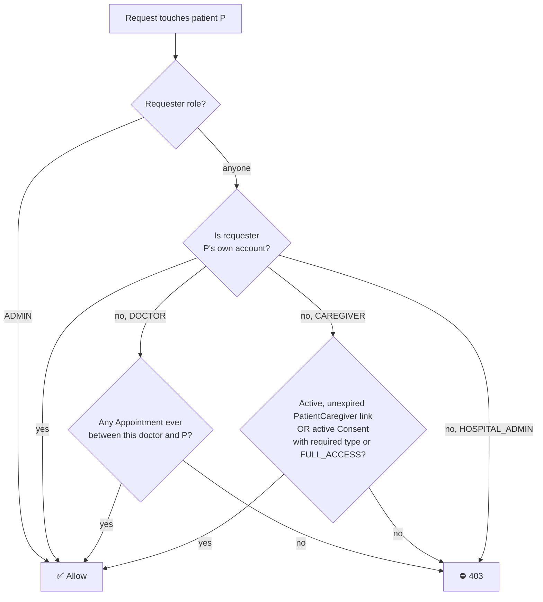
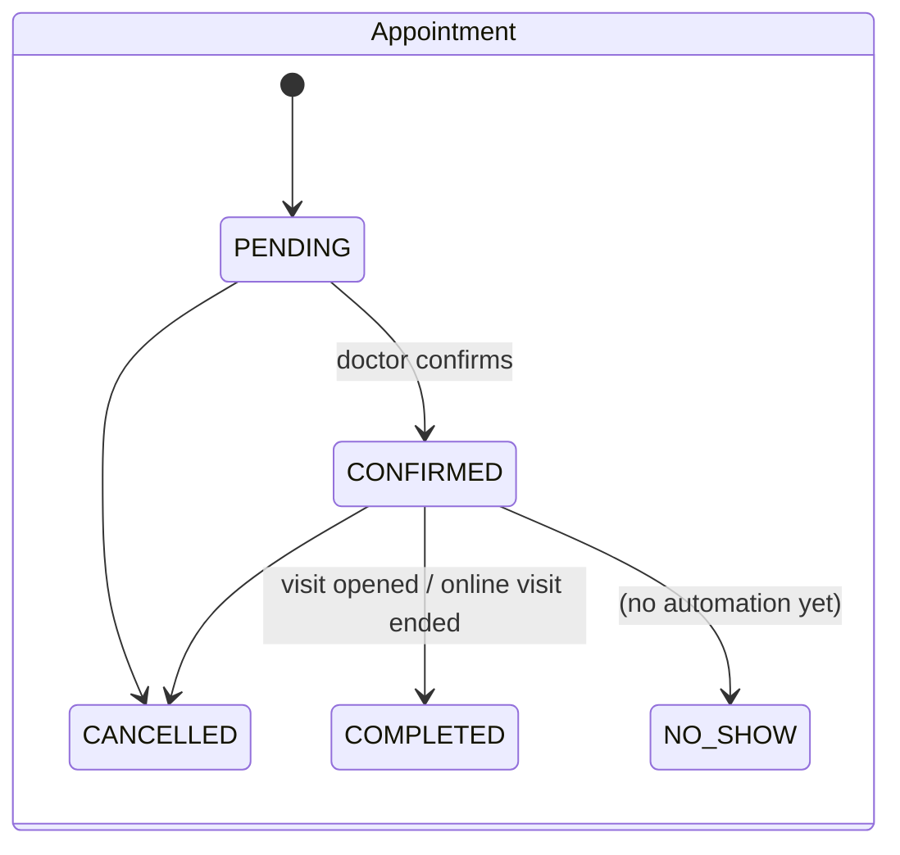
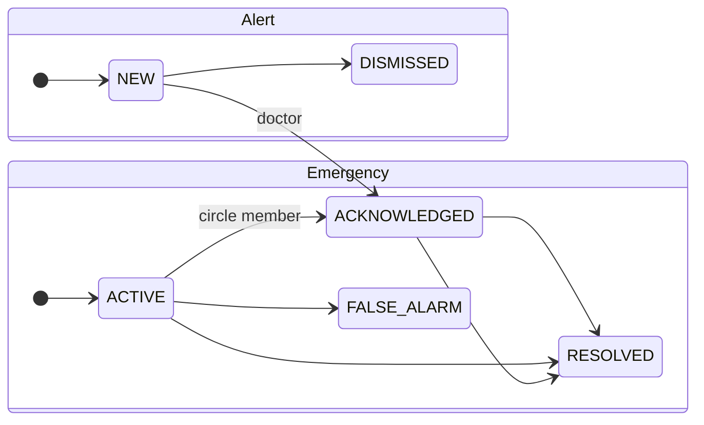
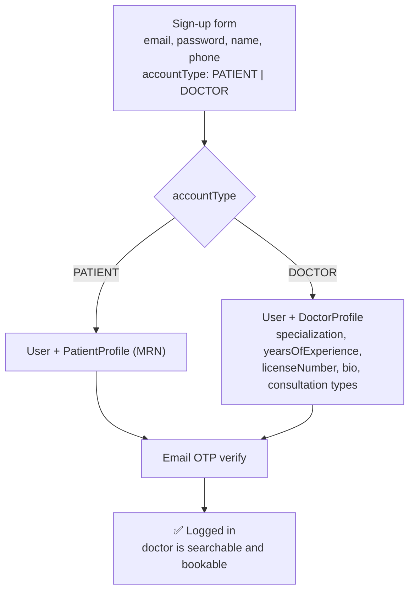
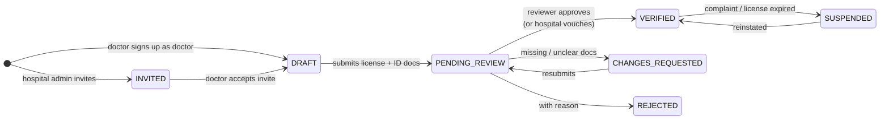
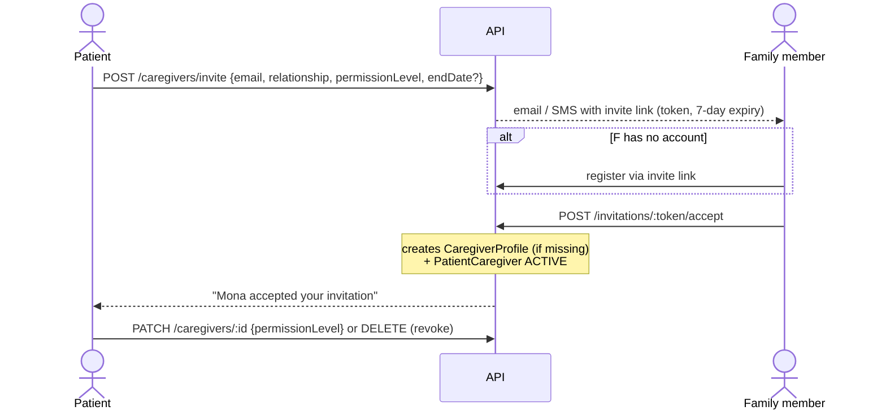
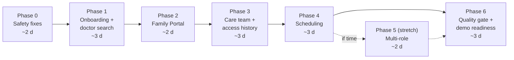

# SmartCare AI — System Workflow & Improvement Plan

> **Who this is for:** anyone who needs the whole system in their head: backend
> engineers, Flutter developers, and product owners.
> **Part 1** describes how the system works **today**, based on the code in `src/`
> and `prisma/schema.prisma`.
> **Part 2** describes how it **should** evolve, with alternatives and a
> recommendation for each. Every section is tagged with the **decision** taken
> and its **scope**: 🎓 **GP1** (the graduation MVP) or ⏭️ **GP2** (Graduation
> Project 2 / later). §19 is the step-by-step delivery plan for the MVP.
>
> Diagrams use Mermaid. They render on GitHub and in VS Code with the
> "Markdown Preview Mermaid Support" extension.

---

## Contents

**Part 1 — How the system works today**

1. [The system in one paragraph](#1-the-system-in-one-paragraph)
2. [Actors and their apps](#2-actors-and-their-apps)
3. [Technical architecture](#3-technical-architecture)
4. [The data model in four layers](#4-the-data-model-in-four-layers)
5. [Onboarding: how each actor gets an account](#5-onboarding-how-each-actor-gets-an-account)
6. [The access rule: who may see a patient's data](#6-the-access-rule-who-may-see-a-patients-data)
7. [The end-to-end patient journey](#7-the-end-to-end-patient-journey)
8. [Background engines](#8-background-engines)
9. [Lifecycles (state machines)](#9-lifecycles-state-machines)
10. [Module and endpoint map](#10-module-and-endpoint-map)

**Part 2 — What should change**

11. [Doctor onboarding: alternatives to admin promotion](#11-doctor-onboarding-alternatives-to-admin-promotion)
12. [Institutions: hospitals as real tenants](#12-institutions-hospitals-as-real-tenants)
13. [One person, many roles](#13-one-person-many-roles)
14. [Doctor access to patient data: from "ever booked" to "care relationship"](#14-doctor-access-to-patient-data-from-ever-booked-to-care-relationship)
15. [Family Portal: caregiver invitations](#15-family-portal-caregiver-invitations)
16. [Scheduling and discovery](#16-scheduling-and-discovery)
17. [Clinical safety and correctness fixes](#17-clinical-safety-and-correctness-fixes)
18. [Security, compliance and operations](#18-security-compliance-and-operations)
19. [MVP delivery plan (GP1) and what moves to GP2](#19-mvp-delivery-plan-gp1-and-what-moves-to-gp2)

---

# Part 1 — How the system works today

## 1. The system in one paragraph

SmartCare AI manages a patient's whole care journey. A **patient** signs up, can
describe symptoms to an **AI triage** assistant, and **books a doctor** (in
person, video or chat). The **doctor** runs a **visit**, records diagnoses, tests
and imaging, and issues a **treatment plan with prescriptions**. Each
prescription automatically generates a **dose schedule**, and the patient gets a
reminder for every dose. After the visit, the patient's **vital signs** arrive
manually or from paired devices. Abnormal readings, missed doses and AI risk
raise **alerts** to the doctor and family, and critical ones open an
**emergency**. If nobody responds, the emergency escalates by SMS. **Family
members (caregivers)** watch over the patient with permissions the patient
grants. **Hospital admins** see aggregate dashboards but never individual
records.

## 2. Actors and their apps

| Actor | Role enum | App surface | What they do |
|---|---|---|---|
| Patient | `PATIENT` | Patient mobile app | Records, triage, booking, vitals, meds, SOS, chat |
| Doctor | `DOCTOR` | Doctor dashboard | Appointments, visits, diagnosis, prescriptions, alert center |
| Caregiver (family) | `CAREGIVER` | Family Portal | Monitor a linked patient, receive alerts, book on their behalf |
| Hospital operator | `HOSPITAL_ADMIN` | Hospital dashboard | Aggregate analytics only (doctor load, adherence, readmissions) |
| Platform admin | `ADMIN` | Back office | Create hospitals and departments, promote doctors, manage first-aid content |

## 3. Technical architecture



Key design choices already in place:

- **Each layer has one job.** The JWT guard answers *who are you*. `@Roles()`
  answers *is your role allowed on this endpoint*.
  `ConsentService.assertCanAccessPatient()` answers *may you touch this
  particular patient*.
- **Degrades gracefully.** Without Redis, queue jobs run inline and delayed jobs
  fall back to in-process timers. Without `AI_SERVICE_URL`, triage falls back
  to a rule-based provider.
- **Audit trail.** Every successful mutating request is logged with who, what,
  when and from where. Request bodies are never stored.

## 4. The data model in four layers

Reading the schema is easier if you look at it as four layers. Everything
clinical hangs off `PatientProfile`.



| Layer | Tables | Purpose |
|---|---|---|
| **1. Identity** | `User`, `PatientProfile`, `DoctorProfile`, `CaregiverProfile`, `OtpCode`, `RefreshToken` | `User` is the **login account**: email, password, role, status. The profile is the **person**: name, license, medical record number. Exactly one profile exists per account, matching its role. |
| **2. Organization** | `Hospital`, `Department` | Reference data. A doctor *optionally* belongs to a hospital and department. |
| **3. Relationships and permissions** | `Appointment`, `PatientCaregiver`, `Consent` | **These decide who can see whom.** (See §6.) |
| **4. Clinical record** | `Visit`, `Assessment`, `Diagnosis`, `MedicalTest`, `TestResult`, `MedicalImage`, `TreatmentPlan`, `Prescription`, `PrescriptionItem`, `MedicineTracking`, `VitalSign`, `Device`, `DeviceReading`, `Alert`, `EmergencyEvent`, `MedicalDocument` | The patient's health data. Every row reaches `PatientProfile` directly or through its parent. |
| *Supporting* | `Notification`, `DeviceToken`, `Chat`, `ChatParticipant`, `Message`, `FileObject`, `AuditLog`, `FirstAidGuide` | Messaging, files, push, compliance. |

Two business rules shape the model:

- **BR-004: every Visit hangs off an Appointment.** You can't record a clinical
  encounter without a booking, so the appointment is the proof that a doctor
  treats a patient.
- **BR-007: every Prescription belongs to a TreatmentPlan.** The plan supplies
  the patient and the prescribing doctor.

## 5. Onboarding: how each actor gets an account



| Actor | Today | Gap |
|---|---|---|
| Patient | Self-service: register → verify email → done. | None. |
| Doctor | Must register as a patient, then **an admin promotes them by hand** and sets `isVerified = true` straight away. | No application step, no document review, no rejection path, and no way for the doctor to start the process. (§11) |
| Hospital | Admin creates the record. A hospital is not an account and has no members. | Hospitals can't onboard or manage their own staff. (§12) |
| Caregiver | **No API.** Only seeded accounts exist. | Blocks the Family Portal. (§15) |
| Hospital admin | **No API**, and the role isn't tied to any hospital. | Dashboards are platform-wide. (§12) |

## 6. The access rule: who may see a patient's data

There is **one gatekeeper**:
`ConsentService.assertCanAccessPatient(requester, patientId, requiredPermission)`
(`src/consent/consent.service.ts`). Every service that reads or writes patient
data calls it first.



Permission vocabulary (`ConsentType`), shared by caregiver links and consents:
`VIEW_RECORDS`, `MANAGE_APPOINTMENTS`, `RECEIVE_ALERTS`, `FULL_ACCESS`.

**The patient's "care circle"** receives alerts and emergencies. It is made of
every doctor with an appointment with the patient, plus every caregiver with
`RECEIVE_ALERTS` or `FULL_ACCESS`.

### How a doctor actually reaches a patient's record

1. The patient (or a caregiver with `MANAGE_APPOINTMENTS`) books an appointment
   with a **verified, active** doctor.
2. That `Appointment` row now exists, so **the doctor passes the gate** for that
   patient from then on.
3. The doctor confirms the appointment, opens a `Visit`, and reads and writes the
   record.
4. Without a booking, the doctor gets `403 "not a treating doctor"`, even inside
   the same hospital.

## 7. The end-to-end patient journey

```mermaid
sequenceDiagram
  autonumber
  actor P as Patient
  participant API as API
  participant AI as AI triage
  actor D as Doctor
  participant BG as Background engines
  actor F as Family (caregiver)

  P->>API: register + verify email
  P->>AI: POST /ai/triage (symptoms)
  AI-->>P: risk level + suggested specialty (saved as AI_INITIAL assessment)
  P->>API: GET /hospitals/:id/doctors → POST /appointments
  Note over API: double-booking check; VIDEO/CHAT → OnlineVisit auto-created
  API-->>D: notification "new appointment"
  D->>API: PATCH /appointments/:id/confirm
  alt in person
    D->>API: POST /visits (from appointment) → appointment COMPLETED
  else online
    D->>API: PATCH /online-visits/:id/start → patient gets "join now"
    D->>API: PATCH /online-visits/:id/end
  end
  D->>API: diagnoses, tests, images, test results
  D->>API: POST /treatment-plans → POST /prescriptions
  Note over API: generates one MedicineTracking row per dose
  loop every minute
    BG-->>P: "time for your medication"
    BG->>BG: dose >60 min overdue → MISSED; 3 in a row → HIGH alert
  end
  P->>API: POST /vitals (manual or device batch)
  API->>BG: threshold check → Alert (1h dedupe)
  BG-->>D: alert push
  BG-->>F: alert push (if RECEIVE_ALERTS)
  alt CRITICAL alert or SOS button
    BG-->>D: EMERGENCY push
    BG-->>F: EMERGENCY push
    Note over BG: 2-min timer; if nobody acknowledges → SMS emergency contacts
    F->>API: PATCH /emergency/:id/acknowledge (stops escalation)
  end
  D->>API: PATCH /visits/:id/close
```

## 8. Background engines

| Engine | Trigger | What it does | Where |
|---|---|---|---|
| **Alert engine** | Called by vitals, the medication scheduler and AI | Creates an `Alert`, ignores duplicates from the same source within 1h, notifies the care circle, and escalates CRITICAL alerts to an emergency | `alerts.service.ts` → `raise()` |
| **Emergency hub** | SOS button or CRITICAL alert | Pushes to the care circle, arms a 2-min escalation job, then sends SMS to emergency contacts in priority order. Acknowledging stops the chain. | `emergency.service.ts`, BullMQ `escalations` queue |
| **Medication scheduler** | Cron, every minute | Sends dose reminders. Marks doses missed. Raises an adherence alert after 3 consecutive misses. | `medication-scheduler.service.ts` |
| **Notification dispatcher** | Any `notify()` call | Stores a `Notification` and sends an FCM push through a queue | `notifications.service.ts`, BullMQ `notifications` queue |
| **Risk snapshot** | `GET /ai/patients/:id/risk` | Deterministic score from vitals, open alerts, adherence and emergencies. Every contributing factor is listed, so the score can be explained. | `ai.service.ts` |

## 9. Lifecycles (state machines)





Visit: `OPEN → CLOSED | FOLLOW_UP_REQUIRED`.
Dose (`MedicineTracking`): `SCHEDULED → TAKEN | SKIPPED | MISSED`.
Online visit: `SCHEDULED → ACTIVE → COMPLETED`, or `CANCELLED`.

## 10. Module and endpoint map

| Module | Main endpoints | Who |
|---|---|---|
| auth | `register`, `verify-email`, `login`, `social/firebase`, `refresh`, `logout`, `forgot/reset-password` | Public |
| users | `GET/PATCH /users/me`, avatar, password; `POST /users/:id/doctor-profile` | Self; ADMIN |
| hospitals | `GET /hospitals`, `/:id/doctors`; CRUD + departments | All; ADMIN |
| appointments | `POST`, `GET /my`, `/doctors/:id/schedule`, `confirm`, `cancel` | Patient/caregiver book; doctor confirms |
| visits / assessments | `POST /visits`, `close`, `diagnoses`, `tests`, `images`, `tests/:id/result` | Doctor |
| treatment | `treatment-plans`, `prescriptions`, `medicines`, `medications/doses/*`, adherence | Doctor writes; patient takes doses |
| vitals / devices | `POST /vitals`, `/vitals/batch`, devices + readings | Patient writes; circle reads |
| alerts | `GET /alerts/my-patients`, `/patients/:id`, `PATCH status` | Doctor |
| emergency | `POST /emergency/sos`, `acknowledge`, `resolve`, contacts; `first-aid` | Patient; circle |
| telemedicine | `online-visits` start / end / cancel | Doctor + patient |
| chat | `chats`, messages, read, leave (+ Socket.IO) | Treating pairs only |
| documents / uploads | `medical-documents`, `uploads` | Owner + circle |
| ai | `POST /ai/triage`, `GET /ai/patients/:id/risk` | Patient; circle |
| analytics | `overview`, `doctor-load`, `adherence-by-department`, `alert-quality`, `readmissions` | HOSPITAL_ADMIN, ADMIN |
| notifications | tokens, list, unread count, read, archive | Self |

---

# Part 2 — What should change

Each section gives the **problem**, the **alternatives**, a **recommendation**,
and a **data-model sketch** where one helps. The plan in §19 orders the work.

**The MVP rule.** GP1 must be a *complete, working, defensible* product, not a
feature checklist. A feature goes into GP1 only if (a) the main demo journey
needs it, (b) it fixes a privacy or safety hole an examiner could find, or
(c) leaving it out would force rework later. Everything else goes to GP2.

### Decision log

| Section | Topic | Decision | Scope |
|---|---|---|---|
| §11 | Doctor onboarding | **Doctors self-register directly**: choose the doctor role at sign-up and add specialization, years of experience and license number. No review queue. | 🎓 GP1 (simplified) · review queue ⏭️ GP2 |
| §12 | Hospitals as tenants | **Skipped** | ⏭️ GP2 |
| §13 | One person, many roles | Recommendation accepted | 🎓 GP1 stretch (Phase 5) |
| §14 | Doctor access → care relationship | Recommendation accepted | 🎓 GP1 steps 1, 2, 4 · break-the-glass ⏭️ GP2 |
| §15 | Caregiver invitations | Recommendation accepted | 🎓 GP1 · guardian accounts ⏭️ GP2 |
| §16 | Scheduling and discovery | Recommendation accepted | 🎓 GP1 |
| §17 | Clinical safety fixes | Recommendation accepted | 🎓 GP1 items 1–3, 5 · per-patient thresholds ⏭️ GP2 |
| §18 | Security and operations | Recommendation accepted | 🎓 GP1 items 1, 4 · rest ⏭️ GP2 |
| §19 | Old roadmap | **Replaced** by the MVP delivery plan | — |

## 11. Doctor onboarding: alternatives to admin promotion

> **Decision: GP1 uses direct self-registration.** A doctor signs up, picks
> **Doctor** as the account type, and fills in their professional details in
> the same form. They can log in and be booked as soon as their email is
> verified. The review queue, credentials and registry check below (options
> B–D) move to ⏭️ GP2. The design is kept here so GP2 can build on it.

### GP1 design: direct doctor registration



- `POST /auth/register` gains `accountType` (default `PATIENT`) and a
  `doctor` object that is **required when `accountType = DOCTOR`**. It contains
  `specialization` (from a fixed list, so search works), `yearsOfExperience`,
  `licenseNumber` (unique) and an optional `bio`.
- Registration creates the matching profile **in the same transaction** as the
  `User` row, so there is never a doctor account without a doctor profile.
- **Doctors become bookable only after verifying their email** (same OTP flow
  as patients). `isVerified` stays in the schema but is set automatically in
  GP1. GP2 replaces it with the `verificationStatus` state machine below
  without changing the API.
- Social sign-in (Google / Apple) creates a patient. A doctor completes a
  `POST /doctors/me/profile` step after sign-in to switch to doctor.
- `PATCH /doctors/me` lets doctors edit their professional details later.
- **Safety valve (since nobody reviews doctors):** an admin can suspend a
  doctor with `PATCH /admin/doctors/:id/status`. A suspended doctor can't be
  booked and fails the access gate. The old
  `POST /users/:id/doctor-profile` is removed.
- **Known MVP limitation**, stated openly in the defence: license numbers are
  not checked. GP2 adds options B–D.

### The problem (why admin promotion goes away)

Today a doctor must (1) sign up as a *patient*, (2) contact an admin outside the
platform, and (3) wait for the admin to call
`POST /users/:id/doctor-profile`. That call **switches the role and marks the
doctor verified in the same step**.

- **Product:** a doctor can't sign up as a doctor. There is no application form,
  status page, or "you were rejected because…". This is the first thing a
  doctor sees, and it blocks growth.
- **Trust:** "verified" means only that an admin clicked a button. No license
  documents are stored, no reviewer is recorded, and nothing records when or why
  the doctor was approved. If a regulator asks "who approved Dr X, and on what
  evidence?", the system can't answer.
- **Scale:** the platform team must hand-onboard every doctor of every hospital.
- **Modelling:** promotion *replaces* the PATIENT role, so a doctor loses the
  patient-only endpoints for their own health (logging vitals, SOS). See §13.

### Alternatives

| # | Option | How it works | Pros | Cons |
|---|---|---|---|---|
| A | **Keep admin promotion** (today) | Admin flips the role | Zero work | Everything above |
| B | **Self-service application + verification queue** | Doctor picks "I'm a doctor" at sign-up, uploads license and ID, and the profile starts as `PENDING_REVIEW`. A reviewer approves or rejects with a reason. | Doctor-driven, auditable, clear status | The platform team still reviews every doctor |
| C | **Hospital-led invitation** | A verified hospital admin invites a doctor by email. The doctor accepts, and the hospital vouches for the license. | Scales through institutions. Fits B2B sales. | Independent doctors have no path |
| D | **Automated license registry check** | Check the license number against the national medical syndicate or health ministry registry API | Fast and objective | Depends on a registry API being available; usually a complement, not a replacement |

### GP2 recommendation: **B + C together, with D added later**

Two entry points lead to the same verification state machine:



- **Independent doctors** follow path B. A platform reviewer approves them.
- **Hospital doctors** follow path C. The hospital admin invites them, and the
  hospital admin's approval counts as verification for that hospital.
  Platform admins can spot-check.
- Only `VERIFIED` doctors are bookable or can access records. Today's
  `isVerified` check in booking keeps working; it just reads the new status.
- **License expiry:** a daily job moves doctors whose `licenseExpiresAt` has
  passed to `SUSPENDED` and notifies them 30 days in advance.

**Data-model sketch**

```prisma
enum DoctorVerificationStatus {
  DRAFT
  INVITED
  PENDING_REVIEW
  CHANGES_REQUESTED
  VERIFIED
  REJECTED
  SUSPENDED
}

model DoctorProfile {
  // ...existing fields...
  verificationStatus DoctorVerificationStatus @default(DRAFT) // replaces isVerified
  licenseIssuer      String?   // e.g. "Egyptian Medical Syndicate"
  licenseExpiresAt   DateTime?
  credentials        DoctorCredential[]
  reviews            VerificationReview[]
}

/// Uploaded evidence: license card, national ID, specialty certificate.
model DoctorCredential {
  id        Int            @id @default(autoincrement())
  doctorId  Int
  doctor    DoctorProfile  @relation(fields: [doctorId], references: [id])
  type      CredentialType // LICENSE, NATIONAL_ID, SPECIALTY_CERT, OTHER
  fileId    Int            // FileObject (private bucket)
  createdAt DateTime       @default(now())
}

/// Every decision, append-only — the answer to "who approved Dr X and why".
model VerificationReview {
  id         Int                      @id @default(autoincrement())
  doctorId   Int
  doctor     DoctorProfile            @relation(fields: [doctorId], references: [id])
  reviewerId Int                      // User (platform ADMIN or HOSPITAL_ADMIN)
  fromStatus DoctorVerificationStatus
  toStatus   DoctorVerificationStatus
  reason     String?
  createdAt  DateTime                 @default(now())
}
```

**Endpoints**

```
POST  /auth/register                  { ..., accountType: "PATIENT" | "DOCTOR" }
PUT   /doctors/me/application         profile fields (DRAFT / CHANGES_REQUESTED only)
POST  /doctors/me/credentials         attach uploaded files
POST  /doctors/me/application/submit  DRAFT → PENDING_REVIEW
GET   /doctors/me/application         status + last review reason

GET   /admin/doctor-applications?status=PENDING_REVIEW
POST  /admin/doctor-applications/:id/decision  { decision, reason }

POST  /hospitals/:id/invitations      HOSPITAL_ADMIN invites { email, role: DOCTOR, departmentId }
POST  /invitations/:token/accept
```

The existing `POST /users/:id/doctor-profile` can stay as an **admin override**
(for example, for seeding). It should write a `VerificationReview` row like any
other decision.

## 12. Institutions: hospitals as real tenants

> **Decision: skipped for GP1 → ⏭️ GP2.** In GP1, `Hospital` and `Department`
> stay as admin-managed reference data. A doctor may *optionally* pick one at
> registration. Analytics stay platform-wide and are shown to `ADMIN`. The
> Flutter "Hospital Dashboard" surface (H-01…H-03) becomes the admin analytics
> screen. The design below is kept for GP2.

### The problem

`Hospital` is a passive record. It has no admins, no members and no onboarding,
and `HOSPITAL_ADMIN` isn't linked to any hospital. As a result, every hospital
admin sees **platform-wide** analytics, and a hospital can't manage its own
doctors.

### Alternatives

| Option | Description | Verdict |
|---|---|---|
| `hospitalId` column on `User` | Simplest | Breaks as soon as someone works in two places (common for doctors) |
| **`HospitalMembership` table** | One row per (user, hospital, role) | ✅ Recommended |
| Full multi-tenant (schema or DB per hospital) | Strong isolation | Far too heavy for this stage |

### Recommendation

```prisma
enum HospitalStaffRole { HOSPITAL_ADMIN DOCTOR NURSE RECEPTIONIST }
enum MembershipStatus  { INVITED ACTIVE SUSPENDED LEFT }

model HospitalMembership {
  id           Int               @id @default(autoincrement())
  hospitalId   Int
  userId       Int
  role         HospitalStaffRole
  departmentId Int?
  status       MembershipStatus  @default(INVITED)
  invitedById  Int?
  createdAt    DateTime          @default(now())

  @@unique([hospitalId, userId, role])
}
```

**Hospital onboarding flow:**

1. A hospital submits an application (legal name, license or commercial
   registration, contact person).
2. A platform admin approves it. The hospital becomes `ACTIVE`, and the contact
   person becomes its first `HOSPITAL_ADMIN` membership.
3. The hospital admin invites doctors, nurses and receptionists (§11 path C) and
   manages departments.
4. Analytics are scoped automatically to the hospitals where the caller has an
   active `HOSPITAL_ADMIN` membership. This fixes BACKEND-GAPS B-04.

This also allows a **receptionist** role to search patients by MRN and book on
their behalf (BACKEND-GAPS B-05). That role sees identity data only, never
clinical data.

## 13. One person, many roles

> **Decision: recommendation accepted → 🎓 GP1 stretch (Phase 5).** It isn't
> needed for the demo journey, so it comes after the core phases. Phase 1 keeps
> registration forward-compatible (one profile per account type), so adding
> this later needs no rework. If time runs out, it moves to GP2.

### The problem

`User.role` holds a single value. Real people have several:

- A doctor is also a patient. After promotion, `@Roles(Role.PATIENT)` endpoints
  (`POST /vitals`, `POST /emergency/sos`, `POST /ai/triage`, medication doses)
  **reject them**, even though their own `PatientProfile` still exists.
- A caregiver for their mother may be a patient themselves.
- A doctor may work at two hospitals.

### Recommendation

Keep the **profiles** as they are; that design is already right. Derive the
roles from the profiles a user has, and stop storing one exclusive role:

- A user *is a patient* if they have a `PatientProfile`, *a doctor* if they have
  a `VERIFIED` `DoctorProfile`, *a caregiver* if they have a `CaregiverProfile`.
  Hospital roles come from `HospitalMembership`. `ADMIN` stays a flag
  (`isPlatformAdmin`).
- The JWT carries `roles: [...]`, and the `RolesGuard` checks membership
  (`roles.includes(required)`).
- The app shows a **context switcher** ("My health" / "My practice" / "My
  family"), the same pattern as switching workspaces in Slack.

**Migration:** add `roles` to the JWT payload, derived from the profiles, while
keeping `User.role` as the *default context* for older clients. Then retire it.

## 14. Doctor access to patient data: from "ever booked" to "care relationship"

> **Decision: recommendation accepted.** 🎓 GP1: step 1 (Phase 0), step 2 and
> step 4 (Phase 3). ⏭️ GP2: step 3 (break-the-glass) and referrals.

### The problem

The gate asks one question: has this doctor *ever* had an appointment with this
patient, in any status? As a result:

- A **cancelled** appointment grants **permanent** access to the full record.
- A doctor seen once, years ago, keeps reading new vitals, documents and alerts
  forever, and stays in the alert and emergency circle.
- The patient can't see who has access, or revoke it.
- **Reads are not audited.** The interceptor logs only mutating requests, so
  "who viewed my record" can't be answered. Health-data rules (HIPAA-style, and
  the BRD's SEC-003) expect read access to be traceable.
- In a real emergency, an ER doctor with no booking has **no access at all**.

### Alternatives

| # | Option | Pros | Cons |
|---|---|---|---|
| A | Tighten the query: only non-cancelled appointments, and only within N months of the last visit | One-line change, closes the worst hole | Still implicit; patient has no visibility |
| B | **Explicit `CareRelationship` table** created when the doctor confirms the appointment, with an expiry the patient can see and revoke | Clear, auditable, patient-controlled, cheap queries | New table plus a migration of existing data |
| C | Per-request consent prompt ("Dr X wants to view your labs") | Maximum patient control | Too much friction for routine care |

### Recommendation: **A now, B next, plus break-the-glass and read auditing**

**Step 1 (quick fix, this sprint):**

```ts
appointments: {
  some: {
    patientId: patient.id,
    status: { in: [CONFIRMED, COMPLETED] },
    startTime: { gte: subMonths(new Date(), CARE_WINDOW_MONTHS) }, // e.g. 12
  },
},
```

Apply the same filter in `patientCircleUserIds()` so former doctors stop
receiving emergencies.

**Step 2: the `CareRelationship` model**

```prisma
enum CareRelationshipStatus { ACTIVE EXPIRED REVOKED }
enum CareRelationshipOrigin { APPOINTMENT REFERRAL BREAK_GLASS HOSPITAL_ADMISSION }

model CareRelationship {
  id         Int                    @id @default(autoincrement())
  patientId  Int
  doctorId   Int
  origin     CareRelationshipOrigin
  status     CareRelationshipStatus @default(ACTIVE)
  startsAt   DateTime               @default(now())
  expiresAt  DateTime?              // auto-extended by each new visit
  reason     String?                // mandatory for BREAK_GLASS
  revokedAt  DateTime?

  @@unique([patientId, doctorId, origin])
  @@index([doctorId, status])
}
```

- **Created** when the doctor confirms an appointment. Each visit extends
  `expiresAt` (for example, to last visit + 12 months).
- **Patient controls:** `GET /me/care-team` lists the doctors with access and
  when each grant expires. `DELETE /me/care-team/:id` revokes one.
- **Referral:** a treating doctor can refer the patient to a colleague, creating
  a `REFERRAL` relationship. The patient is notified and can revoke it.
- The gate becomes one indexed lookup. It also gives BACKEND-GAPS B-03 ("my
  patients") a natural query.

**Step 3: break-the-glass emergency access**

A verified doctor with no relationship can request emergency access. They must
type a reason. Access lasts 24 hours, and the system immediately notifies the
patient and their caregivers ("Dr X accessed your record in an emergency:
'unconscious in ER'"). Every such access is flagged for review. This is
standard in hospital EHR systems.

**Step 4: read audit**

Log every `assertCanAccessPatient` decision, allowed or denied, as an
`AuditLog` row with action `READ_PATIENT` and the target patient id. Show the
patient an "Access history" screen. Writes stay fire-and-forget, so latency
doesn't change.

## 15. Family Portal: caregiver invitations

> **Decision: recommendation accepted → 🎓 GP1 (Phase 2).** Guardian accounts
> for minors move to ⏭️ GP2. Caregivers can't pick "caregiver" at sign-up;
> they become caregivers only by accepting a patient's invitation.

### The problem

The tables (`PatientCaregiver`, `Consent`) and the access check exist, but **no
API creates them** (BACKEND-GAPS B-01, B-02). The Family Portal has no real users.

### Recommendation: an invitation flow driven by the patient, with no admin involved



- The **BRD limits the portal to two companions**. Enforce a configurable
  maximum number of active links per patient.
- **Permission presets** in the UI ("Alerts only", "Alerts + appointments",
  "Full access") map onto `ConsentType`.
- A **minor or dependent patient** can be managed by a guardian with
  `FULL_ACCESS`, so a parent can run a child's account.
- Revoking sets `status = REVOKED` and keeps the row for the audit trail.

## 16. Scheduling and discovery

> **Decision: recommendation accepted → 🎓 GP1.** Doctor search moves into
> Phase 1. With hospitals skipped, it is now the **only** way patients find
> doctors. Availability, reminders, auto-expiry and no-show are Phase 4.

| Problem today | Recommendation |
|---|---|
| Patients can only find doctors **hospital by hospital** (`GET /hospitals/:id/doctors`), and the list isn't paginated. | `GET /doctors?specialty=&q=&hospitalId=&availableOn=&type=VIDEO`, paginated. Link the triage result ("suggested specialty: cardiology") directly to this search. That is the main conversion path from triage to booking. |
| The system knows only a doctor's **busy** slots. It has no working hours, so patients can book at 3 a.m. | Add `DoctorAvailability` (weekday, start, end, slot length, location or online), plus `DoctorTimeOff`. The schedule endpoint returns **free** slots. |
| `PENDING` appointments wait forever if the doctor never confirms. | Auto-expire after N hours, with a notification to both sides. Alternatively, let doctors opt into **auto-confirm**. |
| `NO_SHOW` exists but nothing sets it. | Daily job: a `CONFIRMED` appointment with no visit or session after `endTime + grace` becomes `NO_SHOW`. This feeds the analytics. |
| No appointment reminders. | Push reminders 24h and 1h before, through the existing notifications queue. |

## 17. Clinical safety and correctness fixes

> **Decision: recommendation accepted.** 🎓 GP1 (Phase 0): items 1, 2, 3, 5.
> ⏭️ GP2: item 4 (per-patient thresholds).

| # | Issue | Risk | Fix |
|---|---|---|---|
| 1 | **Dose times are fixed hours in UTC** (`SLOT_HOURS` in `treatment.service.ts`). A "9:00" dose fires at 11:00 or 12:00 in Cairo, and "23:00" becomes 1 or 2 a.m. | Reminders arrive at the wrong time, and the "missed" logic penalizes patients | Store `timezone` on `PatientProfile` (IANA, e.g. `Africa/Cairo`) and generate slots in local time. Let the patient adjust their intake times. |
| 2 | Medication scheduler runs as an in-process cron | With two API instances, every reminder is sent twice | Move it onto the BullMQ repeatable job that already exists, or take a Postgres advisory lock per tick |
| 3 | Without Redis, the emergency escalation timer is an in-process `setTimeout` | If the server restarts, the SMS escalation **silently never fires** | Make Redis mandatory in production (fail fast on boot). Add a sweeper job that escalates `ACTIVE` events older than the delay. |
| 4 | Vital thresholds are platform-wide constants | They are wrong for many patients (a COPD patient's normal SpO₂ is lower) | Per-patient threshold overrides set by the treating doctor |
| 5 | AI triage could be read as a diagnosis | Liability | Keep the "assistive, not diagnostic" disclaimer in every response. Log the model version per assessment. Route CRITICAL triage straight to the emergency hub. |

## 18. Security, compliance and operations

> **Decision: recommendation accepted.** 🎓 GP1: item 1 (Phase 0) and item 4
> (Phase 3). ⏭️ GP2: items 2, 3, 5, 6, 7.

| # | Issue | Recommendation |
|---|---|---|
| 1 | CORS reflects **any origin with credentials** (`origin: true, credentials: true` in `main.ts`), and the Socket.IO gateway uses `origin: '*'`. This was marked "temporary". | Allow-list origins from an env var before production |
| 2 | Sequential integer ids in URLs (`/patients/42`). Access checks stop unauthorized reads, but the ids reveal how many patients exist and make probing easy. | Add a public `uuid` column for external ids. Keep integer primary keys internally. |
| 3 | Sensitive fields (allergies, chronic diseases, insurance number) are stored in plain text | Encrypt at the column level for the most sensitive fields, and keep DB encryption at rest on. The BRD promises "end-to-end encryption". |
| 4 | No reads in the audit log | See §14, step 4 |
| 5 | Doctors have no step-up security | Require 2FA (TOTP) for `DOCTOR`, `HOSPITAL_ADMIN` and `ADMIN` accounts |
| 6 | `ADMIN` bypasses the consent gate entirely | Keep platform admins away from clinical data by default. Use break-the-glass with a reason for support cases. |
| 7 | Data retention and deletion are undefined | Define a retention policy, a patient data export (`GET /me/export`) and an account deletion flow with legal holds on clinical records |

## 19. MVP delivery plan (GP1) and what moves to GP2

> **Progress (6 Oct 2026):** Phases 0, 1, 2 and 3 are ✅ done and covered by
> end-to-end tests (`npm run test:e2e`). Frontend handoff:
> [flutter/BACKEND-CHANGES-MVP.md](flutter/BACKEND-CHANGES-MVP.md).
> Implementation notes that differ from the plan below:
> - Phase 0: production without Redis logs a loud warning instead of failing
>   to boot. The database sweeper already guarantees emergency SMS, and a
>   hard failure would have broken the current server on redeploy.
> - Phase 0: `CORS_ORIGINS` empty still allows every origin (deliberate,
>   matches the existing setup); set it to lock down.
> - Phase 2: invitations are matched by the invitee's email inside the app
>   (`GET /invitations/my`) instead of an emailed token.
> - Phase 2: a caregiver needs an active link for any access; extra consents
>   only add permissions on top of it.
> - Phase 5 will use an *active role* the user switches (`User.role`), not a
>   role list checked per request.
>
> **Next:** Phase 4 (scheduling), then 5 (stretch) and 6.

**Goal of GP1:** one complete, reliable journey that can be demoed end to end
without workarounds: *a patient and a doctor sign up → the patient finds and
books the doctor → visit → prescription → reminders → vitals → alert →
family is notified → emergency escalation.* Privacy must hold at every step.

**How to work through it**

- Phases run **in order**. Each one ends with a **definition of done**, and the
  next phase starts only when the previous one meets it.
- One phase = one small set of commits on `master`, with Swagger docs and
  tests updated in the same commits.
- Effort is rough backend time for one engineer and doesn't include Flutter work.



Total: **about 16 working days of backend work** for the must-have phases, plus
2 days for the stretch phase.

### Phase 0: Safety and correctness fixes (~2 d)

Small fixes to existing behaviour. They go first because every later phase
builds on correct foundations.

| Task | Section |
|---|---|
| CORS and Socket.IO origin allow-list from `CORS_ORIGINS` env | §18.1 |
| Doctor access gate and care circle: only `CONFIRMED`/`COMPLETED` appointments within a 12-month window | §14 step 1 |
| `PatientProfile.timezone` (default `Africa/Cairo`); dose slots generated in local time | §17.1 |
| Redis required when `NODE_ENV=production` (fail fast on boot); sweeper escalates overdue `ACTIVE` emergencies | §17.3 |
| Medication scheduler protected by a Postgres advisory lock (safe on multiple instances) | §17.2 |
| Triage: CRITICAL result opens an emergency; disclaimer and model version stored on the assessment | §17.5 |

**Done when:** a cancelled-only appointment returns 403. A 9:00 dose for a Cairo
patient is due at 07:00 UTC in winter and 06:00 UTC in summer. Restarting the
server mid-emergency still sends the SMS. Unit tests cover all three.

### Phase 1: Onboarding and doctor search (~3 d)

| Task | Section |
|---|---|
| `POST /auth/register` with `accountType` (`PATIENT`/`DOCTOR`) and doctor details, all in one transaction | §11 GP1 |
| Fixed specialization list (enum or seeded table), shared with AI triage's "suggested specialty" | §11, §16 |
| `GET /doctors/me`, `PATCH /doctors/me`; doctor completion step for social sign-in | §11 GP1 |
| `GET /doctors?specialty=&q=&type=&page=` (verified, active, paginated) + `GET /doctors/:id` | §16 |
| `PATCH /admin/doctors/:id/status` (suspend / reactivate); remove `POST /users/:id/doctor-profile` | §11 GP1 |
| Triage response links to the doctor search for the suggested specialty | §16 |

**Done when:** a new doctor can register in the app, verify their email, appear
in search and receive a booking, with no admin involved. A suspended doctor
disappears from search and gets 403 on patient records.

### Phase 2: Family Portal (~2 d)

| Task | Section |
|---|---|
| `POST /caregivers/invite`, `POST /invitations/:token/accept` (creates `CaregiverProfile` + link) | §15 |
| `GET /caregivers/my`, `GET /caregivers/patients`, `PATCH /caregivers/:id`, `DELETE /caregivers/:id` | §15 |
| `POST /consents`, `GET /consents/my`, `PATCH /consents/:id/revoke` | §15 |
| Maximum 2 active companions per patient (configurable); permission presets | §15 |

**Done when:** a patient invites a family member, the member accepts and
receives a real vital-anomaly alert, and after the patient revokes access, the
member gets 403 on the next request.

### Phase 3: Care team and access transparency (~3 d)

| Task | Section |
|---|---|
| `CareRelationship` table, created when an appointment is confirmed and extended by each visit; migrate existing appointments | §14 step 2 |
| Access gate and care circle read `CareRelationship` instead of appointments | §14 step 2 |
| `GET /me/care-team`, `DELETE /me/care-team/:id` (patient revokes a doctor) | §14 step 2 |
| `GET /doctors/me/patients` with last visit, open alerts and adherence | BACKEND-GAPS B-03 |
| Read audit: every access decision logged; `GET /me/access-history` | §14 step 4, §18.4 |

**Done when:** a patient can see exactly which doctors can read their record and
who opened it, and can remove a doctor. That doctor immediately loses access
and stops receiving alerts.

### Phase 4: Scheduling (~3 d)

| Task | Section |
|---|---|
| `DoctorAvailability` (weekly hours, slot length, in-person/online) + `DoctorTimeOff`; doctor endpoints to manage them | §16 |
| `GET /doctors/:id/slots?date=` returns **free** slots; booking rejects times outside availability | §16 |
| Reminders 24h and 1h before each appointment | §16 |
| `PENDING` appointments auto-expire after N hours; `CONFIRMED` appointments past end + grace become `NO_SHOW` | §16 |

**Done when:** a patient can only pick real free slots, gets both reminders,
and no appointment stays `PENDING` forever.

### Phase 5 (stretch): Multi-role (~2 d)

Do this only if Phases 0–4 are done and meet their definitions of done.
Otherwise move it to GP2.

| Task | Section |
|---|---|
| Roles derived from profiles; JWT carries `roles[]`; `RolesGuard` checks membership | §13 |
| `POST /me/patient-profile` so a doctor can also be a patient; context switch in the app | §13 |

### Phase 6: Quality gate and demo readiness (~3 d)

This phase makes the result look like a finished product. Don't skip it.

| Task |
|---|
| End-to-end test of the full demo journey (Supertest against a test database), running in CI |
| Access-control test matrix: every role × every patient-data endpoint → expected 200/403 |
| Demo seed: realistic doctors across specialties, patients with history, a linked caregiver, one live alert |
| Swagger reviewed: every endpoint has examples and error responses |
| Update Part 1 of this document, `AI-EXPLAINED.md` and `BACKEND-GAPS.md` to match what shipped |
| Production deploy rehearsal (`DEPLOYMENT.md`) and a timed run of the demo script (X-03) |

### ⏭️ Moved to Graduation Project 2

| Item | Section |
|---|---|
| Hospitals as tenants: memberships, hospital onboarding, staff invites, per-hospital analytics, receptionist role | §12 |
| Doctor verification queue, credential uploads, review history, license registry and expiry | §11 B–D |
| Break-the-glass emergency access; doctor-to-doctor referrals | §14 |
| Per-patient vital thresholds | §17.4 |
| Guardian accounts for minors and dependents | §15 |
| Public UUIDs, field-level encryption, 2FA, no admin access to clinical data by default, data export and deletion | §18 |
| Multi-role, if Phase 5 didn't fit | §13 |

---

*Sources: `prisma/schema.prisma`, `src/**/*.service.ts`, `src/**/*.controller.ts`,
`docs/flutter/BACKEND-GAPS.md`. Update Part 1 whenever behaviour changes. Move
Part 2 items into Part 1 as they ship.*
