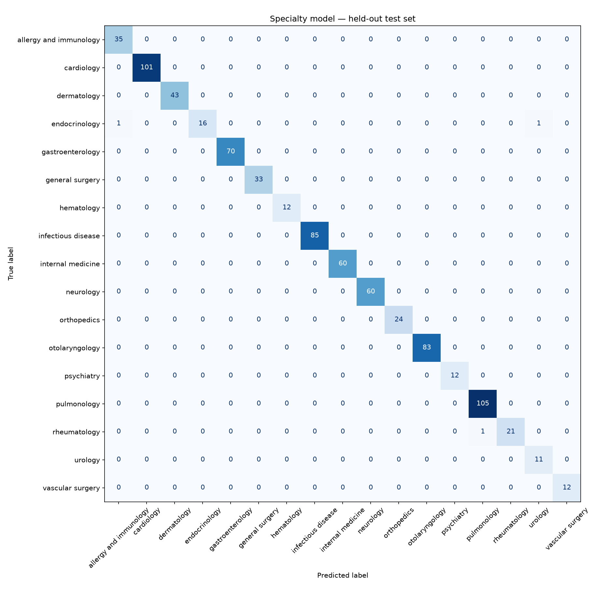
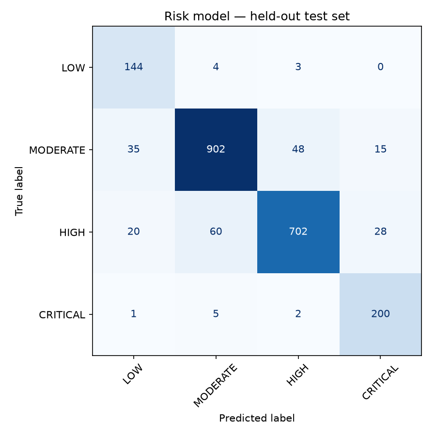
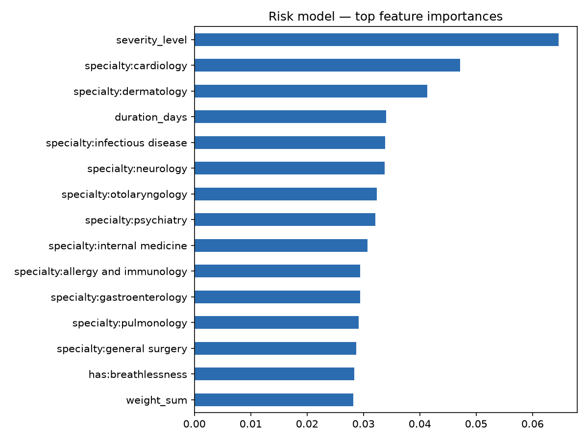

# SmartCare ML — evaluation report

Generated by `python -m src.evaluate`. Trained on 3145 rows; unless stated
otherwise, every number below is measured on held-out test rows the models never saw.

## Specialty model (TF-IDF + Logistic Regression)

Test rows: 786 · classes: 17

| | Rules engine (baseline) | Trained model | Full system |
|---|---|---|---|
| Accuracy | 31.0% | **99.6%** | 99.6% |
| Macro-F1 | 0.192 | **0.992** | 0.992 |

"Full system" = what the service answers: the model, with keyword rules taking
over on short or low-confidence input (see "Short inputs" below).

| Test rows | Rows | Rules accuracy | Model accuracy |
|---|---|---|---|
| ddx | 494 | 27.1% | 99.8% |
| dsp | 61 | 45.9% | 100.0% |
| s2d | 231 | 35.5% | 99.1% |
| only specialties the rules can answer | 587 | 41.6% | 99.7% |

`s2d` = Symptom2Disease (patients' own words) · `dsp` = Disease Symptom Prediction
(checklists) · `ddx` = DDXPlus (synthetic patients, findings turned into text).
The rules engine has no keywords for some specialties (infectious disease,
allergy…), so the last row is the like-for-like comparison.

**The `ddx` row flatters the model.** DDXPlus rows are assembled from a fixed
list of phrases (`data/ddxplus_phrases.json`), so test rows share their wording
with training rows. The same conditions described in a patient's own words are
recognized less reliably and with low confidence — `s2d` is the row that
reflects real phrasing.

```
                        precision    recall  f1-score   support

allergy and immunology       0.97      1.00      0.99        35
            cardiology       1.00      1.00      1.00       101
           dermatology       1.00      1.00      1.00        43
         endocrinology       1.00      0.89      0.94        18
      gastroenterology       1.00      1.00      1.00        70
       general surgery       1.00      1.00      1.00        33
            hematology       1.00      1.00      1.00        12
    infectious disease       1.00      1.00      1.00        85
     internal medicine       1.00      1.00      1.00        60
             neurology       1.00      1.00      1.00        60
           orthopedics       1.00      1.00      1.00        24
        otolaryngology       1.00      1.00      1.00        83
            psychiatry       1.00      1.00      1.00        12
           pulmonology       0.99      1.00      1.00       105
          rheumatology       1.00      0.95      0.98        22
               urology       0.92      1.00      0.96        11
      vascular surgery       1.00      1.00      1.00        12

              accuracy                           1.00       786
             macro avg       0.99      0.99      0.99       786
          weighted avg       1.00      1.00      1.00       786

```



### Read this before quoting the accuracy

The test set contains **new descriptions of diseases the model has already
seen** in training. That is the standard evaluation, and it is what the number
above measures. The harder question is whether the model routes a condition it
has never seen. Stress test: remove one disease from training entirely, retrain,
and ask for its specialty — repeated for 79 diseases (3698 rows):

**Accuracy on never-seen diseases: 49.5%**

Did adding DDXPlus to training help here? Controlled comparison on the same
1180 held-out rows of the two Kaggle datasets (35 diseases):

| Training data | Accuracy on never-seen Kaggle diseases |
|---|---|
| Kaggle datasets only | 47.8% |
| Kaggle datasets + DDXPlus | 46.4% |

| Held-out disease | Correct specialty | Rows | Accuracy | Most often predicted |
|---|---|---|---|---|
| acne | dermatology | 51 | 100% | dermatology |
| acute copd exacerbation / infection | pulmonology | 9 | 100% | pulmonology |
| acute laryngitis | otolaryngology | 60 | 100% | otolaryngology |
| acute pulmonary edema | cardiology | 60 | 100% | cardiology |
| acute rhinosinusitis | otolaryngology | 60 | 100% | otolaryngology |
| alcoholic hepatitis | gastroenterology | 8 | 100% | gastroenterology |
| atrial fibrillation | cardiology | 28 | 100% | cardiology |
| bronchiectasis | pulmonology | 8 | 100% | pulmonology |
| chronic cholestasis | gastroenterology | 8 | 100% | gastroenterology |
| chronic rhinosinusitis | otolaryngology | 60 | 100% | otolaryngology |
| epiglottitis | otolaryngology | 60 | 100% | otolaryngology |
| hepatitis a | gastroenterology | 9 | 100% | gastroenterology |
| hepatitis b | gastroenterology | 9 | 100% | gastroenterology |
| hepatitis c | gastroenterology | 7 | 100% | gastroenterology |
| hepatitis d | gastroenterology | 10 | 100% | gastroenterology |
| hepatitis e | gastroenterology | 9 | 100% | gastroenterology |
| hyperthyroidism | endocrinology | 9 | 100% | endocrinology |
| hypothyroidism | endocrinology | 8 | 100% | endocrinology |
| laryngospasm | otolaryngology | 1 | 100% | otolaryngology |
| myasthenia gravis | neurology | 60 | 100% | neurology |
| stable angina | cardiology | 60 | 100% | cardiology |
| tuberculosis | pulmonology | 23 | 100% | pulmonology |
| unstable angina | cardiology | 60 | 100% | cardiology |
| viral pharyngitis | otolaryngology | 60 | 100% | otolaryngology |
| pulmonary neoplasm | pulmonology | 59 | 98% | pulmonology |
| malaria | infectious disease | 52 | 98% | infectious disease |
| heart attack | cardiology | 65 | 92% | cardiology |
| bronchitis | pulmonology | 60 | 90% | pulmonology |
| myocarditis | cardiology | 60 | 90% | cardiology |
| chagas | infectious disease | 60 | 87% | infectious disease |
| influenza | internal medicine | 60 | 87% | internal medicine |
| dengue | infectious disease | 60 | 80% | infectious disease |
| psvt | cardiology | 60 | 75% | cardiology |
| pericarditis | cardiology | 60 | 73% | cardiology |
| allergic sinusitis | allergy and immunology | 7 | 71% | allergy and immunology |
| fungal infection | dermatology | 55 | 69% | dermatology |
| chicken pox | infectious disease | 59 | 64% | infectious disease |
| typhoid | infectious disease | 59 | 64% | infectious disease |
| peptic ulcer disease | gastroenterology | 57 | 60% | gastroenterology |
| acute dystonic reactions | neurology | 60 | 58% | neurology |
| guillain-barre syndrome | neurology | 60 | 58% | neurology |
| psoriasis | dermatology | 57 | 53% | dermatology |
| pneumonia | pulmonology | 116 | 53% | pulmonology |
| acute otitis media | otolaryngology | 52 | 50% | otolaryngology |
| bronchial asthma | pulmonology | 56 | 50% | pulmonology |
| ebola | infectious disease | 60 | 47% | infectious disease |
| bronchiolitis | pulmonology | 11 | 45% | otolaryngology |
| croup | otolaryngology | 60 | 45% | pulmonology |
| pancreatic neoplasm | gastroenterology | 60 | 42% | gastroenterology |
| jaundice | gastroenterology | 47 | 40% | infectious disease |
| gastroesophageal reflux disease | gastroenterology | 115 | 36% | gastroenterology |
| impetigo | dermatology | 56 | 29% | infectious disease |
| pulmonary embolism | pulmonology | 60 | 13% | cardiology |
| allergy | allergy and immunology | 55 | 13% | internal medicine |
| common cold | internal medicine | 118 | 13% | pulmonology |
| hypoglycemia | endocrinology | 9 | 11% | neurology |
| diabetes | endocrinology | 59 | 10% | allergy and immunology |
| hiv / aids | infectious disease | 65 | 6% | internal medicine |
| drug reaction | allergy and immunology | 56 | 5% | gastroenterology |
| sarcoidosis | pulmonology | 60 | 5% | rheumatology |
| anaphylaxis | allergy and immunology | 60 | 0% | internal medicine |
| arthritis | rheumatology | 52 | 0% | orthopedics |
| boerhaave | general surgery | 60 | 0% | gastroenterology |
| cervical spondylosis | orthopedics | 55 | 0% | cardiology |
| cluster headache | neurology | 60 | 0% | otolaryngology |
| gastroenteritis | gastroenterology | 5 | 0% | infectious disease |
| hemorrhoids | general surgery | 47 | 0% | infectious disease |
| hypertension | cardiology | 56 | 0% | orthopedics |
| inguinal hernia | general surgery | 60 | 0% | allergy and immunology |
| localized edema | internal medicine | 60 | 0% | allergy and immunology |
| migraine | neurology | 57 | 0% | endocrinology |
| osteoarthritis | orthopedics | 7 | 0% | rheumatology |
| paralysis (brain hemorrhage) | neurology | 5 | 0% | infectious disease |
| paroxysmal positional vertigo | otolaryngology | 7 | 0% | infectious disease |
| scombroid food poisoning | internal medicine | 60 | 0% | allergy and immunology |
| sle | rheumatology | 60 | 0% | internal medicine |
| spontaneous pneumothorax | pulmonology | 60 | 0% | cardiology |
| spontaneous rib fracture | orthopedics | 60 | 0% | pulmonology |
| whooping cough | infectious disease | 5 | 0% | orthopedics |

So the model recognizes the conditions it was trained on far better than new
ones. A never-seen disease is routed correctly when its specialty still has
similar diseases in training, and misrouted when it was the only one of its
kind — more diseases per specialty remains the way to improve this.

### Short inputs (how patients actually type in the app)

The datasets describe whole diseases in full sentences. In the app a patient
often enters one or two symptom names. On 63 hand-written inputs of that
kind (`data/short_inputs.csv`, English and Arabic):

| | Rules engine | Trained model alone | Full system |
|---|---|---|---|
| Acceptable specialty | 77.8% | 55.6% | **88.9%** |

The model alone is weak here — it only knows "headache" as one symptom of malaria
or dengue, not as a complaint in its own right — which is why the service lets
keyword rules answer first when the description is short. This set is small and
was used to design that behavior: a development number, not a blind test.

Still wrong in the full system:

| Input | Answered | Acceptable |
|---|---|---|
| yellow skin and dark urine | dermatology | gastroenterology |
| fever | otolaryngology | internal medicine / infectious disease |
| high blood pressure | internal medicine | cardiology |
| excessive thirst and frequent urination | urology | endocrinology |
| weight loss | gastroenterology | endocrinology / internal medicine |
| swollen painful joints in the morning | orthopedics | rheumatology |
| hives after eating peanuts | gastroenterology | allergy and immunology / dermatology |

Risk levels the full system gave these inputs: LOW 19, MODERATE 44, HIGH 0, CRITICAL 0.
Flagged HIGH/CRITICAL: none. On a short input the
risk model may answer MODERATE at most (`assess_risk` in `src/engine.py`): it
learned from full descriptions, and left alone it called single symptoms such as
"acne" or "eye redness" HIGH. Red flags and "severe" still raise a short input.

### What the model learned (largest positive coefficients)

| Specialty | Strongest words |
|---|---|
| allergy and immunology | eyes, itchy, occasionally, headaches, swelling, nose, asthma, body |
| cardiology | headache, dizziness, headache chest, chest, concentrate, chest pain, irregularly, dizzy |
| dermatology | skin, sores, rash, pimples, nails, blackheads, pus, different |
| endocrinology | infections, hunger, dry, vision, palpitations, healing, cuts, hands |
| gastroenterology | stomach, eating, yellow, weight, dark, abdominal pain, heartburn, abdominal |
| general surgery | anus, stool, bloody, anus really, anus quite, bowel, iliac, iliac fossa |
| hematology | pain head, head pain, head, lightheaded, dizzy, pain exhausting, exhausting pain, exhausting |
| infectious disease | lost appetite, vomiting, accompanied, headache, high fever, constipation, red spots, chills |
| internal medicine | throat, sneezing, sinuses, lot, foot, thigh, pressure, really |
| neurology | vision, weakness, eyelids, visual, indigestion, numbness, stiff neck, headaches |
| orthopedics | neck, neck hurts, balance, movement pain, worse movement, weakness, movement, hurts |
| otolaryngology | fever, pain ear, ear pain, ear, whooping cough, whooping, high pitched, pitched |
| psychiatry | dying, feeling, numbness, tingling, surroundings, feeling detached, body surroundings, detached body |
| pulmonology | cough, chest, sputum, coughing, mucus, phlegm, pain finger, finger pain |
| rheumatology | joints, stiff, walking, neck, stiffness, muscles, difficult, wrist |
| urology | pee, urinate, urine, bladder, low, urinating, smells, frequently |
| vascular surgery | legs, calves, veins, cramps, causing, vessels, blood vessels, rash legs |

## Risk model (Random Forest on tabular features)

Simulated triage requests built from the test rows: 2169
(LOW 151, MODERATE 1000, HIGH 810, CRITICAL 208).
Labels are **silver labels** (disease acuity table + context rules, see
`src/train_risk.py`) — not clinician-assigned.

"Full system" = the complete service: red-flag rules, both models, rule floors.

| | Rules engine (baseline) | Risk model alone | Full system |
|---|---|---|---|
| Accuracy | 46.8% | 89.8% | 69.7% |
| Macro-F1 | 0.439 | 0.880 | 0.667 |
| **Urgent recall** (true HIGH/CRITICAL flagged HIGH/CRITICAL) | 68.0% | 91.5% | 93.6% |
| Over-triage (non-urgent flagged HIGH/CRITICAL) | 25.0% | 5.7% | 27.5% |
| LOW recall | 69.5% | 95.4% | 65.6% |
| MODERATE recall | 46.3% | 90.2% | 69.7% |
| HIGH recall | 33.6% | 86.7% | 63.2% |
| CRITICAL recall | 84.1% | 96.2% | 98.1% |

The full system trades accuracy for safety on purpose: red-flag keywords such as
"chest pain" or "shortness of breath" force CRITICAL even when the underlying
condition is milder. Of 634 red-flag emergencies in this test,
459 were for requests whose label is below CRITICAL — the
same over-caution the NestJS rules engine has, by design.

### Emergencies without a red flag

`ML_MAY_DECLARE_EMERGENCY = True` in `src/engine.py`: red-flag rules always
win, and the risk model may additionally declare an emergency when no keyword
matched. Both settings, measured on the same 2169 requests:

| | Rules alone (switch off) | Rules + model (switch on) |
|---|---|---|
| Truly CRITICAL requests reported as CRITICAL (of 208) | 175 | **204** |
| Emergencies declared by the model alone | 0 | 29 |
| …of which false (label below CRITICAL) | 0 | 0 |

"Truly CRITICAL" follows the silver labels: the disease's acuity in
`data/specialty_map.csv`.

```
              precision    recall  f1-score   support

         LOW       0.72      0.95      0.82       151
    MODERATE       0.93      0.90      0.92      1000
        HIGH       0.93      0.87      0.90       810
    CRITICAL       0.82      0.96      0.89       208

    accuracy                           0.90      2169
   macro avg       0.85      0.92      0.88      2169
weighted avg       0.90      0.90      0.90      2169

```



